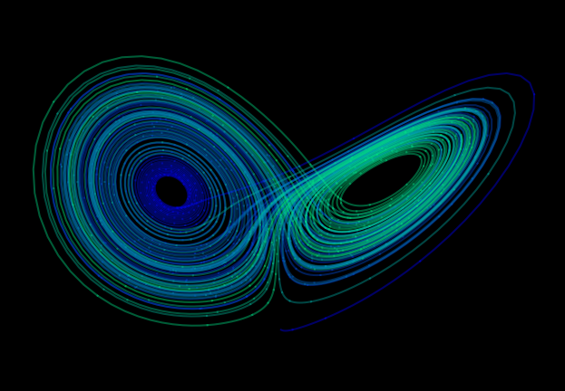

# Lorenz-attractor

The Lorenz Attractor was first studied by Edward Lorenz in the early 1960s. The Lorenz Attractor is a three-dimensional dynamical system that describes the behavior of a simplified model of atmospheric convection. The Lorenz Attractor is an important example of chaotic behavior in dynamical systems. It has been used to study a wide range of phenomena, including fluid dynamics, climate modeling, and economics. The Lorenz Attractor has also been used in cryptography, where chaotic systems are used to generate random numbers for encryption and decryption.

